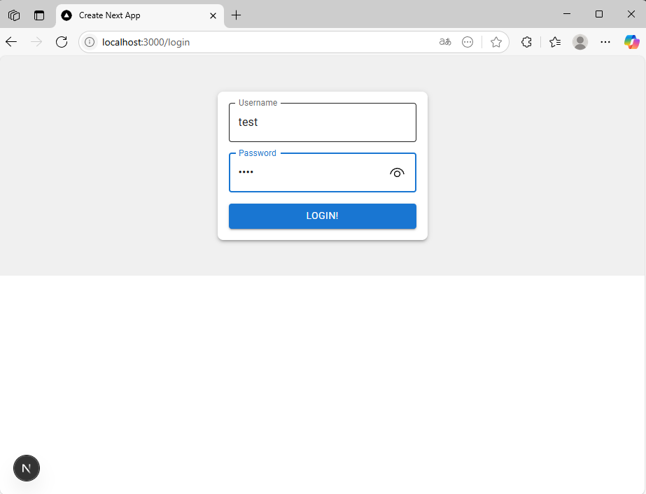
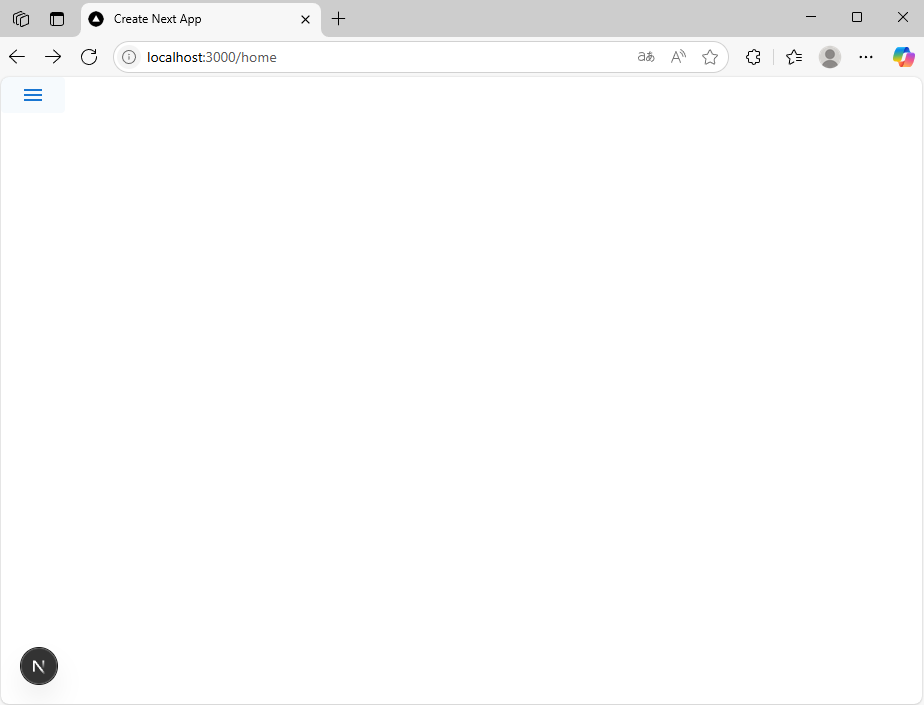
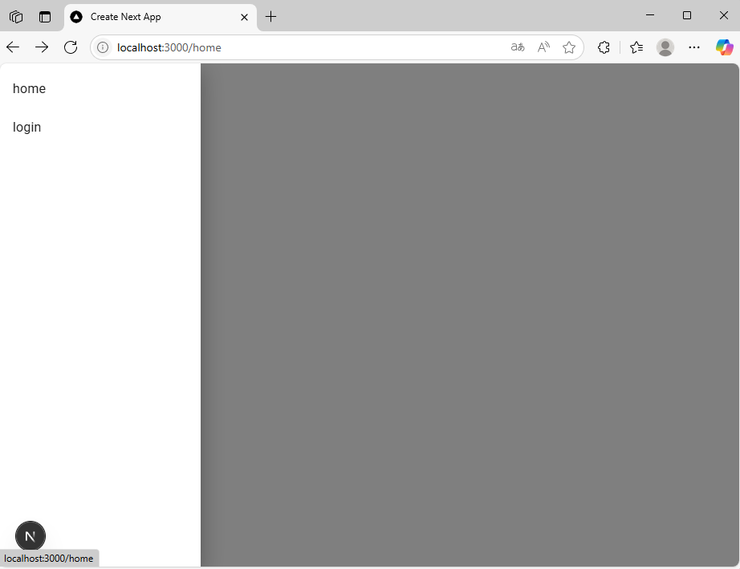

# next.js 基本 ~備忘録~

## ◆ 導入

1. サーバー側でJavaScript を実行するためにnode.js をインストールする
2. yarnの拡張機能を入れる
3. next.js のアプリ基礎をtypescriptと厳格にコードを管理するオプションをつけてビルド

```sh
    # sh
    > yarn create next-app --ts --eslint
```
4. テストで一度起動

```sh
    # sh
    > yarn dev
```

5. 機能追加(基本)

- スタイル系のライブラリ追加
```sh
    # sh
    > yarn add @mui/material @emotion/react @emotion/styled @mui/icons-material
```

6. 機能追加(フォーム用)

- Login用フォーム
```sh
    # sh
    > yarn add react-hook-form
```

## ◆ 作成1 Login フォーム作成

関係ファイル
- app/login/page.tsx



## ◆ 作成2 Drawer 作成

関連ファイル
- app/home/page.tsx
- ./components/Drawer_compose.tsx

Drawer機能：close -> open

■ 図close



■ 図open



